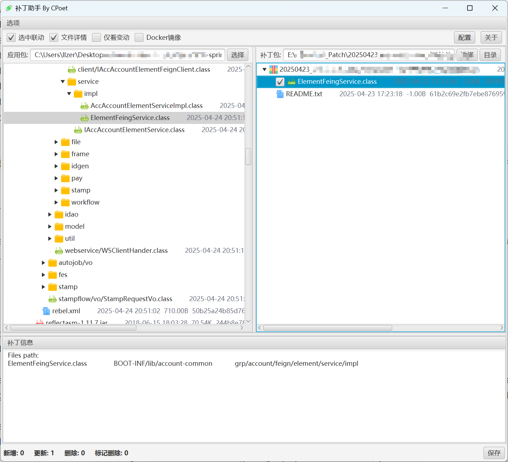

## 补丁助手 By CPoet

### 说明
**快速打补丁，解决手动找类、换类的烦恼。**

### 使用文档
- [PatchAssistant2J安装说明](./docs/PatchAssistant2J安装说明.md)

### 特色功能

1. 支持根据全路径或文件名匹配补丁文件
2. 支付通过说明文件（Readme.txt）匹配文件
3. 支持反编译Class文件和文本差异比较 
4. 支持Jar包、Zip包无限展开
5. 支持常见代码高亮（Java、Html、Css、Js）
6. 支持写入补丁签名信息

### 特别鸣谢

- Fernflower
- richtextfx
- java-diff-utils
