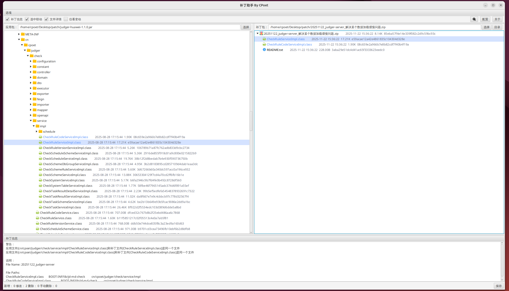
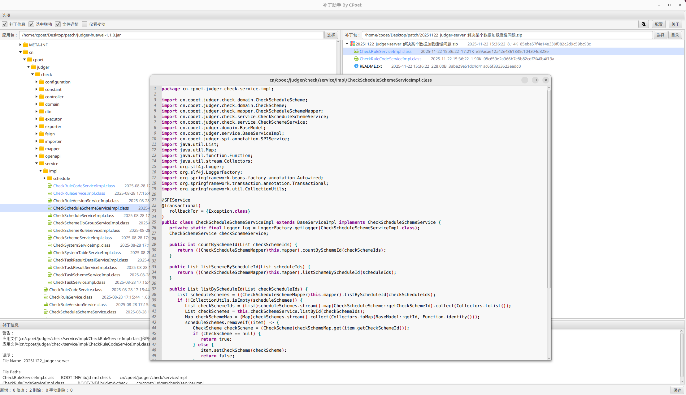
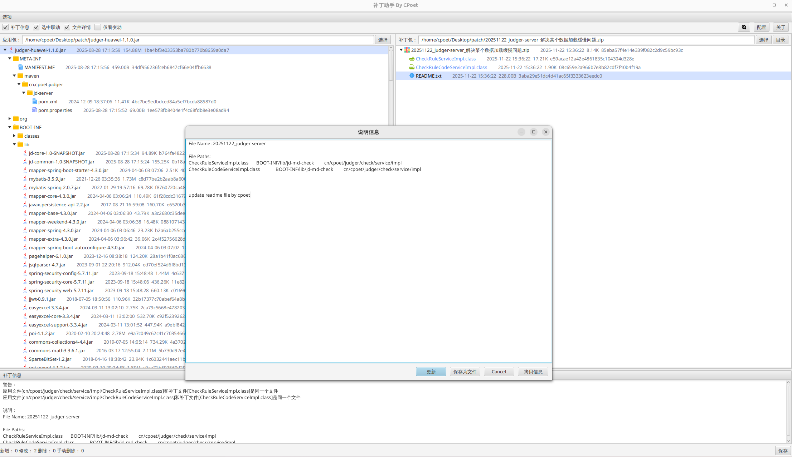
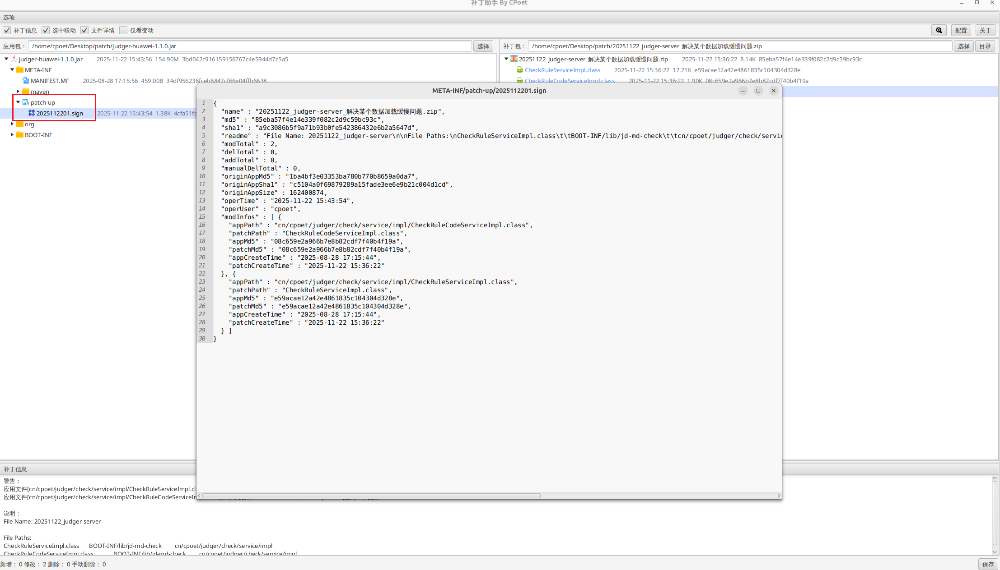

# 🔧 PatchAssistant4J (补丁助手) By CPoet

### 📜 说明
**🚀 Jar应用快速补丁替换**  
去除打增量补丁时通过WinRAR（或者其他压缩工具）手动查找升级文件、替换文件的繁琐。

---

### 🖥️ 界面展示
#### 🏠 主界面

#### 💻 代码反编译

#### 📄 更新说明文件

#### ✏️ 写入补丁签名

---

### 📂 使用文档
- [📌 PatchAssistant2J安装说明](./docs/PatchAssistant2J安装说明.md)

---

### ✨ 核心功能
1. **智能匹配**  
   🔸 全路径/文件名双模式匹配  
   🔸 自动解析Readme.txt升级指令
2. **代码分析**  
   🔸 Class反编译 + 差异高亮对比  
   🔸 支持Java/HTML/CSS/JS语法着色
3. **高效管理**  
   🔸 无限展开Jar/Zip嵌套结构  
   🔸 拖拽式补丁文件替换
4. **安全升级**  
   🔸 补丁签名校验机制  
   🔸 变更记录自动存档

### Current V1.4.7
- [x] 新增写入补丁签名按名称倒叙
- [x] 新增允许拖动文件到应用包路径输入框和补丁包路径输入框
- [x] 新增在应用包或者补丁包加载中时禁用“保存”按钮
- [x] 新增补丁签名中记录应用包路径和补丁包路径
- [x] 修复文件拖到外部应用时因临时文件被删除导致拖动失败问题
- [x] 修复重新加载应用包统计信息始终为零的问题
- [x] 移出打开应用自动聚焦功能

### Next V1.4.8
- [ ] 新增代码反编译支持全局反编译并推断泛型类型
- [ ] 新增重新加载时支持记录已经展开的树型节点
- [ ] 新增应用包和补丁包加载过程中显示已加载内容（闪屏严重，放弃该内容）

---

### 🙏 特别鸣谢
- 🌐 gluonfx
- 🖥️ Fernflower
- ✏️ richtextfx
- 🔍 java-diff-utils
- 🎨 iconfont（图标）

---

🛠️ 开源地址：<a href="https://github.com/c-poet/patch-assistant-to-java">https://github.com/c-poet/patch-assistant-to-java</a>
💖 欢迎Star & Fork！

