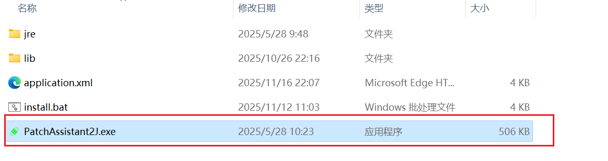
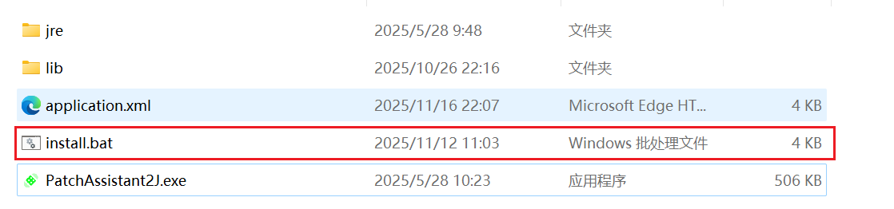
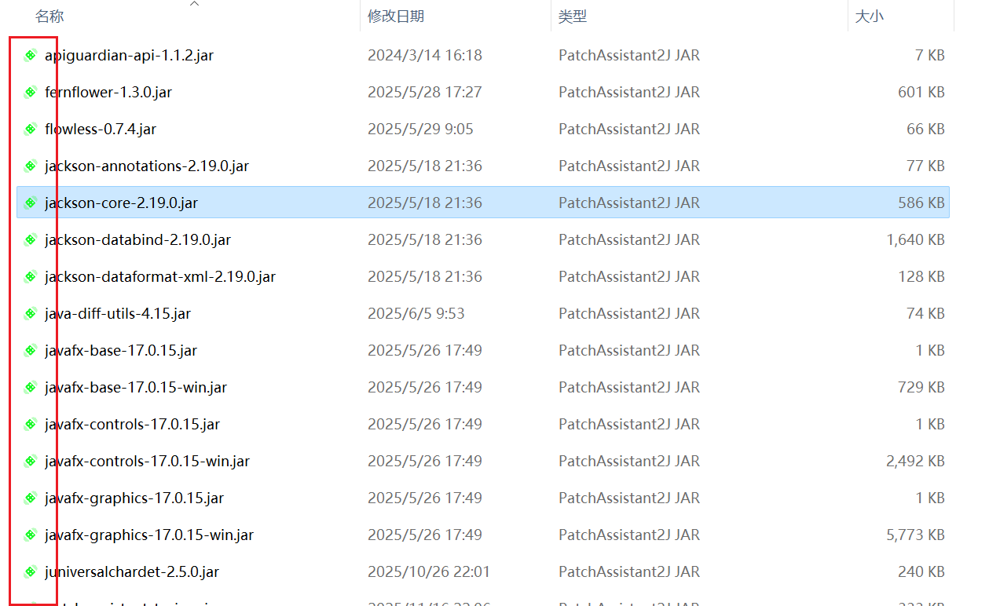

# PatchAssistant2J安装说明

## Window

**Window**系统提供`.exe`启动器，下载补丁助手压缩包并解压缩到合适的目录，双击`PatchAssistant2J.exe`可执行文件打开程序。

如果需要将补丁助手添加到桌面和右键菜单，可以执行`install.bat`文件进行安装。

安装完成后和JAR文件关联效果：

## MacOS&Linux

目前**MacOS**和**Linux**系统未提供启动器，可以通过`java`命令直接启动程序。

**要求：** JDK11+

**命令：**`java -jar patch-assistant-to-java.jar`
