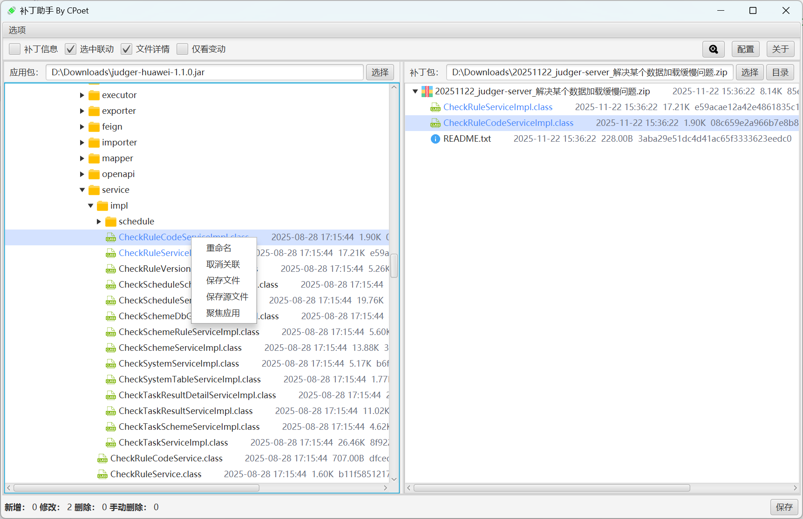
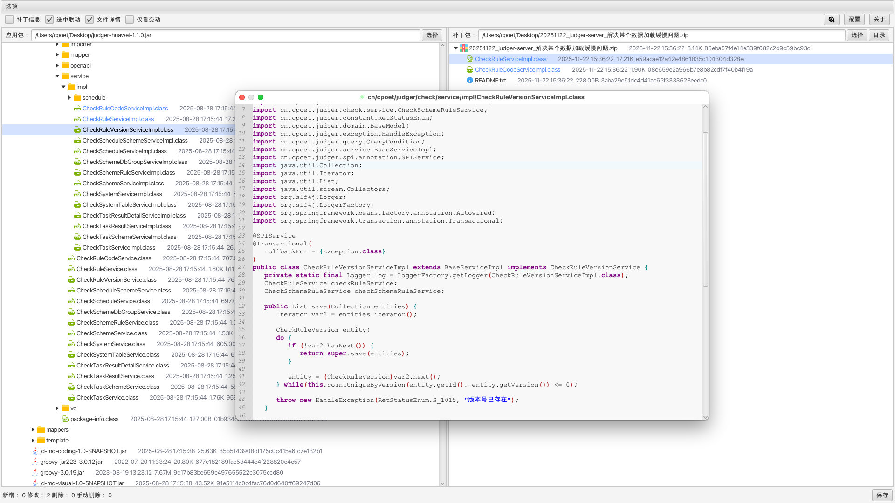
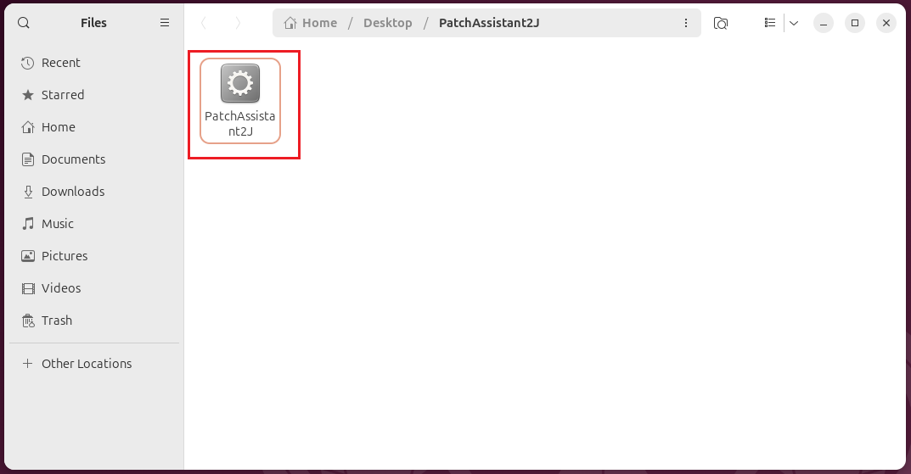
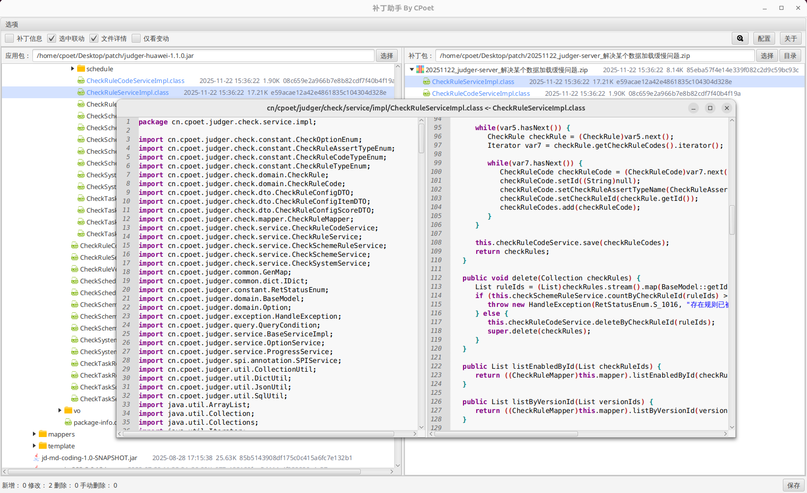

# PatchAssistant2J安装说明

## 下载地址

GitHub: [PatchAssistant2J Releases](https://github.com/c-poet/patch-assistant-to-java/releases)

## Window

Windows提供绿色版本的`exe`单文件和安装版本的`msi`文件，建议通过msi进行安装，不仅会自动创建桌面图标，而且会将`PatchAssistant2J`添加到右键菜单中。

## MacOS

MacOS提供ARM和X86的DMG映像包，可根据自己的电脑架构下载，以X86为例。双击打开下载好的dmg文件，将左侧图标拖入右侧目录。

安装完成后，打开**启动台**找到PatchAssistant2J程序打开。
> **注意：** 因为程序未经过签名，所以首次安装PatchAssistant2J打开时需要在”设置->隐私和安全性“中点击允许。

## Linux

Linux版本支持Ubuntu及其衍生版系统，提供ARM和X84两种架构的可执行文件。

下载Linux对应架构的压缩文件到电脑上，解压会得到一个名为`PatchAssistant2J`的可执行文件，直接运行即可。

> 如果没有可执行权限，可以在PatchAssistant2J文件所在目录下，打开终端执行：`chmod +x ./PatchAssistant2J`

